# ElasticSnaffler

Taking [Snaffler](https://github.com/SnaffCon/Snaffler) analysis to the *next* level using ElasticSearch. Currently in Alpha (&alpha;)

***

## Installation
Simply run:
```bash
pip install -r requirements.txt
```

## Usage
Supported arguments are as follows:
```text
usage: snafflemonster.py [-h] -f FILE -n HOSTNAME [-i INDEX] [-k APIKEY] [-r REPLACE] [-a APPEND] [--insecure INSECURE]

Send Snaffler Output to ElasticSearch for analysis.

optional arguments:
  -h, --help            show this help message and exit
  -f FILE, --file FILE  The path to the JSON file to process.
  -n HOSTNAME, --hostname HOSTNAME
                        Hostname or IP pointing to the ElasticSearch instance.
  -i INDEX, --index INDEX
                        The name of the index to store results in.
  -k APIKEY, --apikey APIKEY
                        The API key used to authentiate to ElasticSearch.
  -r REPLACE, --replace REPLACE
                        Optional argument to delete existing items in the index selected before adding new items.
  -a APPEND, --append APPEND
                        Optional argument to append new items to the selected index.
  --insecure INSECURE   Toggle for allowing sending over HTTPS with verification turned off so self signed or invalid ceritficates can be used.

Happy Snaffling
```

The following is an example of using the program:
```bash
python3 snafflemonster.py -f /Path/To/Snaffler.json -n elasticsearch.snaffler.com
```

If necessary arguments such as Index and Apikey are not provided then the user will be prompted for these values at runtime.

If you don't already have any snaffler output to analyse/send to elasticsearch then you can get/create some by grabbing a copy of Snaffler from [here](https://github.com/SnaffCon/Snaffler/releases).

You can then get/create some output to analyse by running Snaffler like so:
```bash
snaffler.exe -s -o snaffout.json -t json
```

## ElasticSearch Setup
If you don't already have an elasticsearch instance setup then you will want to do that first. I recommend using Docker and Docker Compose because it is nice and easy.

ElasticSearch has documentation on this if you have trouble getting it setup that you can refer to [here](https://www.elastic.co/guide/en/elasticsearch/reference/current/docker.html#docker-compose-file).

The following is some condensed instructions to get you running quickly:
1. You will need to configure your environment file:
```bash
# Password for the 'elastic' user (at least 6 characters)
ELASTIC_PASSWORD=

# Password for the 'kibana_system' user (at least 6 characters)
KIBANA_PASSWORD=

# Version of Elastic products
STACK_VERSION=8.1.0

# Set the cluster name (You can change this if you want to)
CLUSTER_NAME=snafflesearch-docker-cluster

# Set to 'basic' or 'trial' to automatically start the 30-day trial
LICENSE=basic
#LICENSE=trial

# Port to expose Elasticsearch HTTP API to the host
ES_PORT=9200
#ES_PORT=127.0.0.1:9200

# Port to expose Kibana to the host
KIBANA_PORT=5601
#KIBANA_PORT=80

# Increase or decrease based on the available host memory (in bytes)
MEM_LIMIT=1073741824

# Project namespace (defaults to the current folder name if not set, again you can change this if you need/want).
COMPOSE_PROJECT_NAME=snafflesearch
```
Make sure to change any values here to suit your own requirements.

2. Make sure the system supports the memory requirements or ElasticSearch in docker. You can do this by running the following command on a live system:
```bash
sysctl -w vm.max_map_count=262144
```
OR by adding the following to /etc/sysctl.conf:
```bash
vm.max_map_count=262144
```
There are separate instructions for [Windows](https://www.elastic.co/guide/en/elasticsearch/reference/current/docker.html#_windows_and_macos_with_docker_desktop) and [Mac](https://www.elastic.co/guide/en/elasticsearch/reference/current/docker.html#_macos_with_docker_for_mac)

ElasticSearch also recommends modifying [ulimit](https://www.elastic.co/guide/en/elasticsearch/reference/current/docker.html#_increase_ulimits_for_nofile_and_nproc) and disabling [swap](https://www.elastic.co/guide/en/elasticsearch/reference/current/docker.html#_disable_swapping).

3. Once your configuration is ready it should be as easy as:
```bash
docker-compose up
```
To get your ElasticSearch instance up and runnning.

## Creating an API Key
In order to perform operations against the ElasticSearch cluster you just setup you will need an API key. You can create one quite easily by going:
1. Stack Management
2. API Keys
3. Create API Key
4. Give your API Key a name and fill in some options then hit "Create API Key"
5. Save it in secure storage somewhere so you don't forget it or lose it.

This process is also illustrated here:
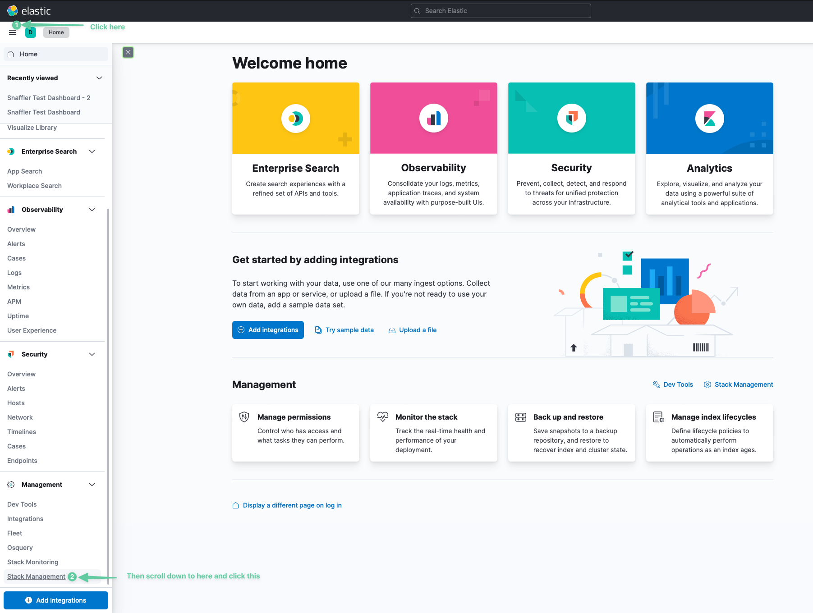
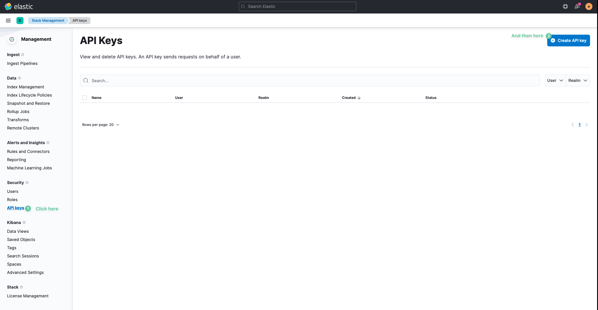
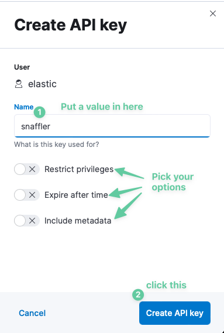
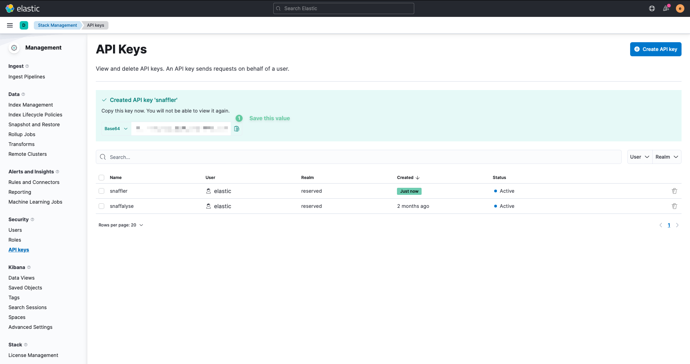

## Dashboards
Kibana will let you visualise the data that you upload using the ingestor. You can create your own dashboards to suit your needs. Currently next on the list of things to implement is creating a demo dashboard automatically along with a requirred data view so wath this space. Whilst I do that though here are some instructions on how to create your own dashboard and start visualising things:

Before you can get started with a dashboard you will need to do two important things.
1. Upload your data to ElasticSearch Index using the ingestor.
2. Create a Data View/Index Pattern for your uploaded data.

Without a Data View/Index Pattern ElasticSearch won't be able to display any data in a Dashboard.

You can create a Data View/Index Pattern by going:
1. Stack Management
2. Data Views
3. Create Data View

This process is also illustrated here:

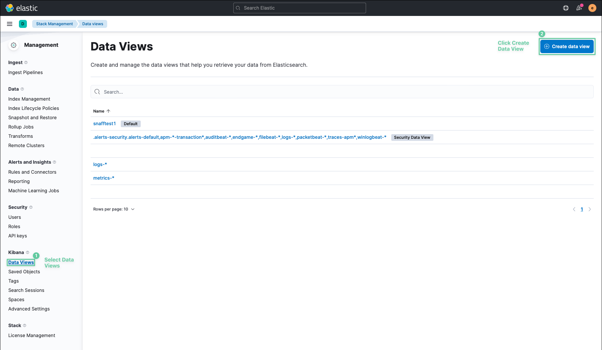
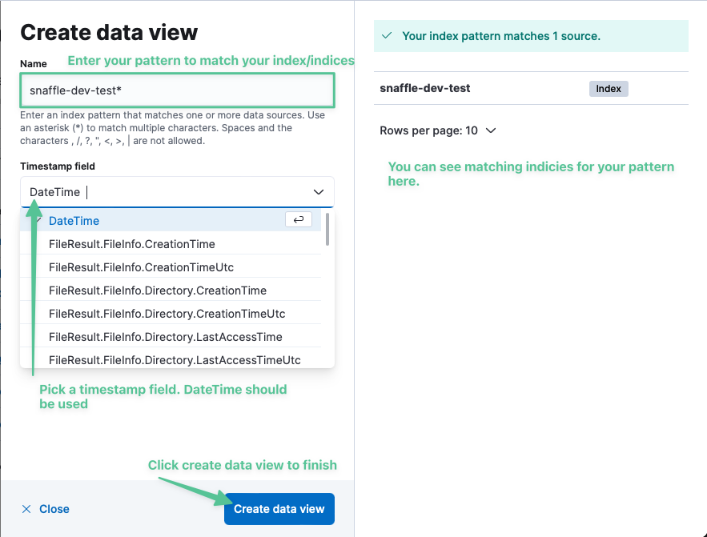

You can create a Dashboard by going:
1. Dashboard
2. Create Dashboard
3. Create Visualisation
4. Pick your data view that you created
5. Choose a field that you want to visualise eg: FileResult.MatchedRule.Triage.keyword (If you get there are no available fields then try extending the time range)
6. Drag the desired field(s) from the available fields section into the middle
7. Change your visualisation type to suit your needs
8. Hit save and return to complete the visualisation
9. Repeat as many times as needed for all the visualisations you want in your dashboard

This process is also illustrated here:
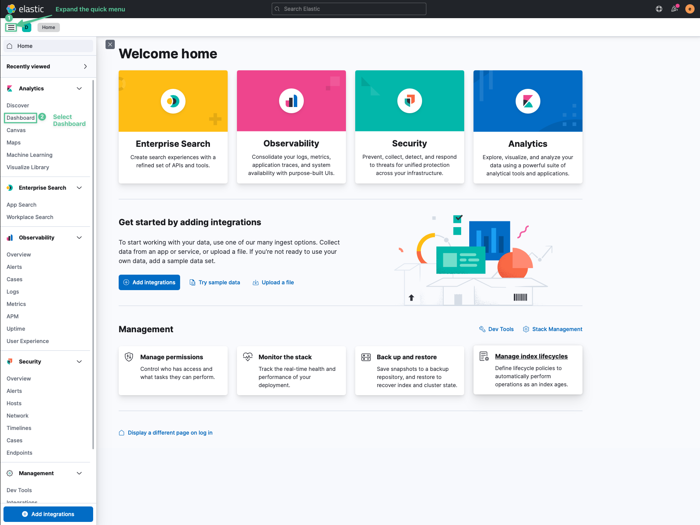
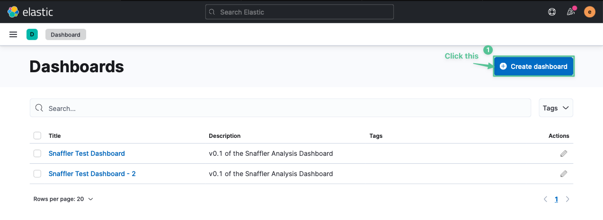
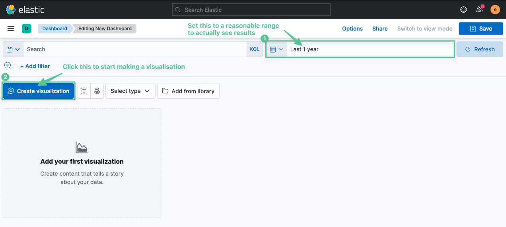
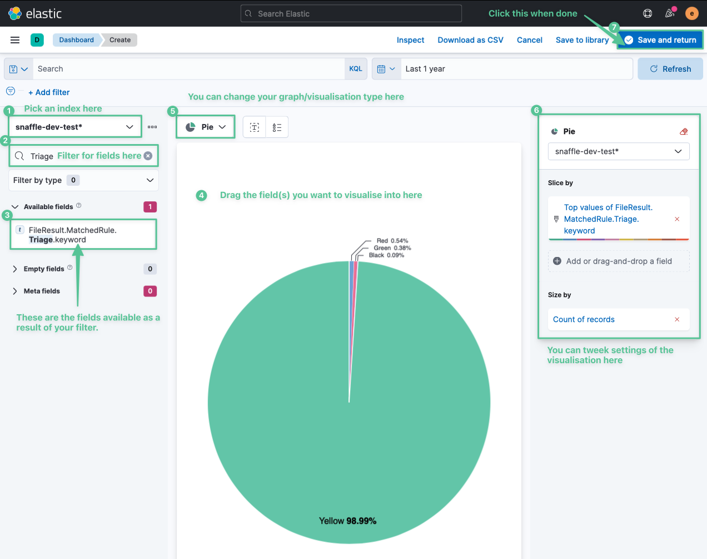

Once you have populated your dashboard with different visualisations you can apply filters by clicking on different fields such as the regions of the pie chart or by clicking add filter and then selecting some options.

Doing this you can end up with something like the following:
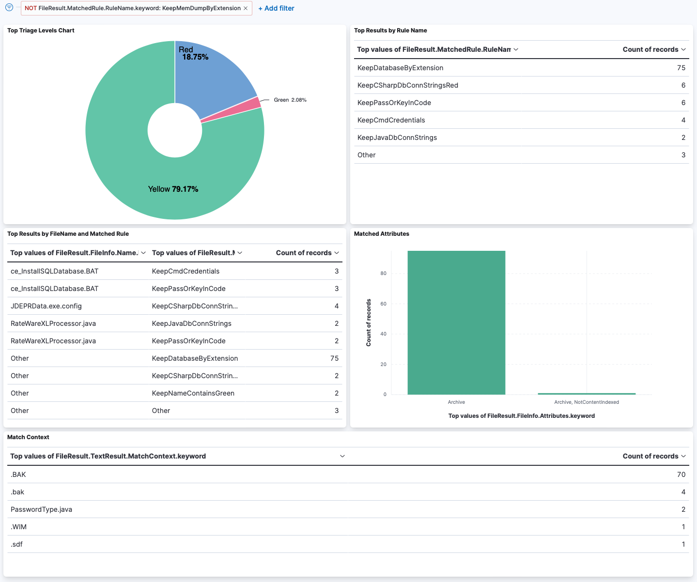

If you have suggestions for better information to display in the dashboard then please share it!
 
## Feature TODO List
 - [ ] Automatic Dashboard and DataView Generation (in progress)
 - [ ] Built in queries (eg: find all scripts that are writable)
 - [ ] Better visualisation of an individual result
 - [ ] Web/Desktop UI To allow for a cleaner/simpler user experience

## Support
Please create an issue if you find a problem. Pull requests are welcome.

## Authors and acknowledgment
Lynkle

## License
This project is license under the GPLv3 license.